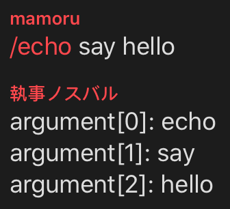
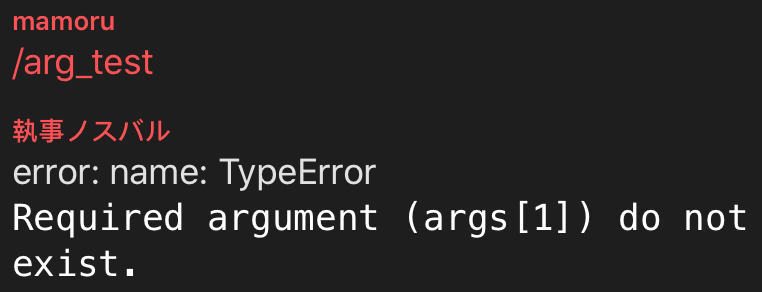
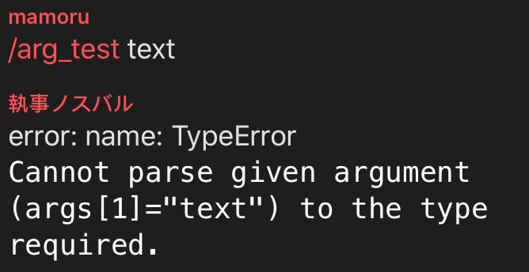
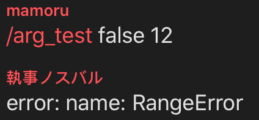
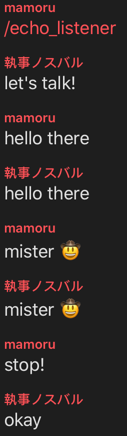

# Telegram Bot Utils

[](https://www.npmjs.com/package/telegram_bot_utils)

A package helps you deploy your application easily on bot.

**This document is still at very early stage.**

**API reference still on the way 🚧**

## Example Usage

```shell
npm i telegram_bot_utils
```

Simply use with [Node.js Telegram Bot API](https://github.com/yagop/node-telegram-bot-api).

### Start your bot

```javascript
const TelegramBot = require('node-telegram-bot-api')
const BotUtils = require('telegram_bot_utils').BotUtils

const token = process.env.BOT_TOKEN || 'token'

const bot = new TelegramBot(token, { polling: true })
const botUtils = new BotUtils('bot_username')

bot.on('message', msg => {
    botUtils.onMessage(msg, 60)
})
```

### Command

#### Add a command

```javascript
botUtils.addCommand(
    'echo',
    (args, msg, userData) => {
        bot.sendMessage(
            msg.chat.id,
            args
                .map((v, i) => {
                    return `argument[${i}]: ${v}\n`
                })
                .join('')
        )
    },
    {
        filter: 'public',
    }
)
```



#### Arguments check

```javascript
botUtils.addCommand(
    'arg_test',
    (args, msg, userData) => {
        bot.sendMessage(msg.chat.id, 'passed')
    },
    {
        filter: 'public',
        argument_check: [
            { type: 'boolean' },
            {
                type: 'integer',
                default_value: 4,
                range: 'function',
                range_function: arg => {
                    return arg <= 5
                },
            },
        ],
        argument_error_function: (_msg, err) => {
            if (err instanceof TypeError) {
                const e = 'name: ' + err.name
                bot.sendMessage(
                    _msg.chat.id,
                    `error: ${e}\n\`${err.message}\``,
                    {
                        parse_mode: 'MarkdownV2',
                    }
                )
            } else if (err instanceof RangeError) {
                const e = 'name: ' + err.name
                bot.sendMessage(
                    _msg.chat.id,
                    `error: ${e}\n\`${err.message}\``,
                    {
                        parse_mode: 'MarkdownV2',
                    }
                )
            }
        },
    }
)
```

<center class="half">
    
    
    
</center>

### Application

For this package, application are using for user data storage, execution priority checking and make your functions more clear. Almost everything binds with application: commands, input listeners, tasks and handle of callback querys.

#### Add applications

```javascript
botUtils.addApplication('calculator')
botUtils.addApplication('groupUtils', {
    priority: -1,
    is_group_need_bind: true,
})
```

#### Bind app with chat

```javascript
botUtils.setApplicationBind('aria2Helper', -1001472983723, true)
```

#### Bind on command

```javascript
botUtils.addCommand(
    'bind',
    (args, msg, userData) => {
        botUtils.setApplicationBind(args[1], msg.chat.id)
        bot.sendMessage(msg.chat.id, `binded app: ${args[1]}`)
    },
    {
        application_name: '_global',
        filter: 'public',
        argument_check: [
            {
                type: 'string',
                range: 'function',
                range_function: name => {
                    return (
                        botUtils
                            .listApplications()
                            .map(app => {
                                return app.name
                            })
                            .indexOf(name) !== -1
                    )
                },
            },
        ],
        argument_error_function: (_msg, err) => {
            if (err instanceof RangeError) {
                const e = 'name: ' + err.name
                bot.sendMessage(
                    _msg.chat.id,
                    `error: ${e}\n\`${err.message}\``,
                    {
                        parse_mode: 'MarkdownV2',
                    }
                )
            }
        },
    }
)
```

### InputListener

Can be useful on force input needed case ( setting to block command trigger or using apps' priority to block other input listener

```javascript
botUtils.addCommand(
    'echo_listener',
    (args, msg, appData) => {
        botUtils.addInputListener(
            msg.chat,
            msg.from,
            (msg, userData) => {
                const text = msg.text
                if (text === 'stop!') {
                    bot.sendMessage(msg.chat.id, 'okay')
                    return true
                } else {
                    bot.sendMessage(msg.chat.id, text)
                    return false
                }
            },
            {
                available_count: Infinity,
                pass_to_command: true,
                init_function: (chat, user, userData) => {
                    bot.sendMessage(chat.id, `let's talk!`)
                },
            }
        )
    },
    {
        filter: 'public',
    }
)
```



### Task

Just use this as a normal timer or making some scheduled and repeat tasks.

```javascript
botUtils.defTask(
    'msgPerMin',
    (rec, recMan, userData) => {
        bot.sendMessage(
            rec.chat_id,
            `task: ${Date.now()} at ${rec.executed_counts}`
        )
    },
    60, // seconds
    Infinity,
    {
        timeout: 20, // also seconds
        import_policy: 'next-restart',
        timeout_action: (rec, recMan, userData) => {
            bot.sendMessage(rec.chat_id, `sorry for late`)
            // recMan.kill()
        },
    }
)

botUtils.addCommand(
    'msgPerMin',
    (args, msg, appData) => {
        bot.sendMessage(msg.chat.id, 'task started.')
        botUtils.startTask('msgPerMin', msg.chat.id, msg.from.id, true)
    },
    {
        filter: 'public',
    }
)
```

### Group Utilities

A simple verify bot for your group:

```javascript
botUtils.addApplication('groupVerify', {
    priority: -1,
    final_app: true,
    is_group_need_bind: true,
    link_chat_free: false,
    link_user_free: false,
})
const genRandom = require('telegram_bot_utils/dist/utils').genRandom

bot.on('message', msg => {
    botUtils.groupUtils().joinListener(msg, () => {
        botUtils.addInputListener(
            msg.chat,
            msg.from,
            (_msg, userData) => {
                const code = userData.get(['code'])
                if (code === _msg.text) {
                    bot.sendMessage(_msg.chat.id, 'welcome new member!', {})
                    userData.set(null)
                    return true
                }
                return false
            },
            {
                application_name: 'groupVerify',
                available_count: 3,
                pass_to_other_listener: false,
                pass_to_command: false,
                init_function: (chat, user, userData) => {
                    const code = genRandom(6)
                    userData.set(code, ['code'])
                    bot.sendMessage(
                        chat.id,
                        `verify code for [${user.first_name}](tg://user?id=${user.id})\n\`${code}\``,
                        { parse_mode: 'MarkdownV2' }
                    )
                },
                final_function: (chat, user, userData) => {
                    userData.set(null)
                    bot.kickChatMember(chat.id, user.id)
                    bot.sendMessage(
                        chat.id,
                        `kicked out ${user.first_name} of group`
                    )
                },
            }
        )
    })
    botUtils.groupUtils().leftListener(msg, () => {
        console.log(`someone left`)
    })
})
```

## How

### Application Data

### Handle CallbackQuery

### Task Import Policy

## License

MIT License
copyright © 2020 MamoruDS
